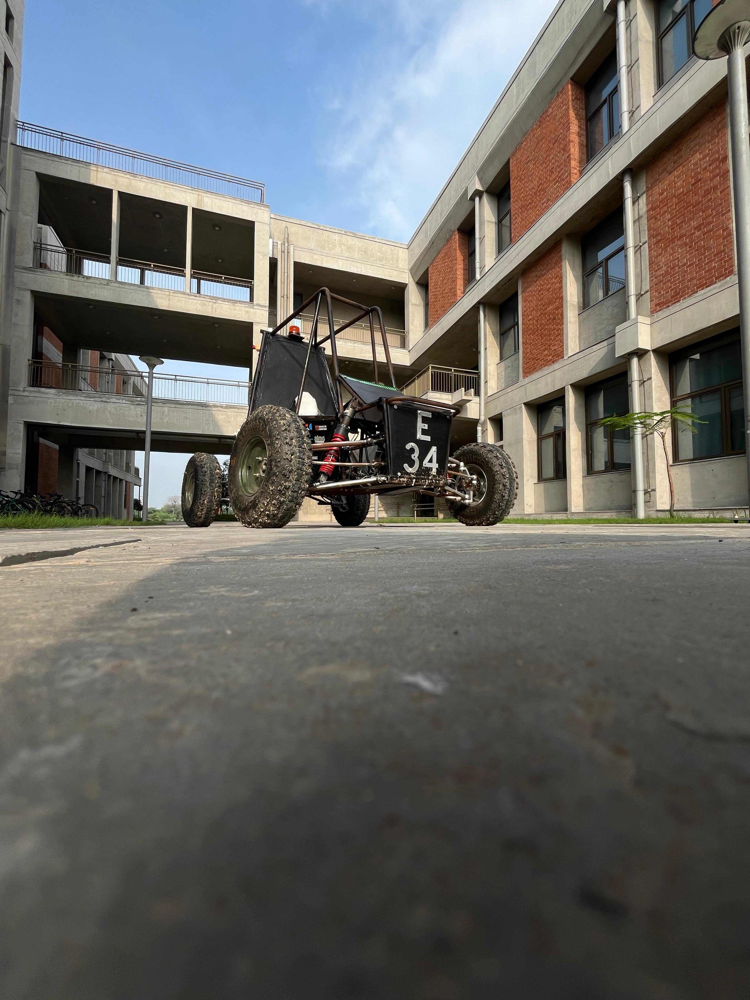

# eBAJA 2025 – Moksha Motorsports

Welcome to the official GitHub repository for our eBAJA 2025 project, developed by the Moksha Motorsports team from IIT Gandhinagar.

This repository showcases the design and manufacturing efforts of our electric All-Terrain Vehicle (ATV) developed as part of SAEINDIA’s eBAJA competition.

  

## 📸 What You'll Find in This Repository
This repository includes:

Images of key components and assemblies we designed and manufactured.

A visual log of our iterative design, validation, and manufacturing processes.

Organizational folder structure to help others understand the scope of subsystems.

### 🚫 Note: The CAD design files (e.g., SolidWorks, STL, etc.) are not included in this repository to protect the intellectual property (IP) of our team.

## 🧩 Subsystems Covered
The images are organized into subfolders representing various subsystems:

### Chassis & Frame

### Suspension

### Steering

### Braking

### Powertrain (Motor, Battery, Wiring)

### Vehicle Integration

Each folder contains images of the final parts, sub-assemblies, and manufacturing stages.

## 🎯 Objective
The goal of this repository is to:

Share our design journey with the broader eBAJA and EV community.

Demonstrate our in-house capabilities in CAD design, FEA, and fabrication.

Provide transparency in our process without compromising on core design IP.

## 🔒 Intellectual Property Notice
We take pride in the originality of our work. While we are happy to share our progress and journey, we have withheld direct design files (e.g., .SLDPRT, .STEP, .STL) to protect our proprietary development efforts.

If you are a judge, collaborator, or academic researcher and need access to design files for review purposes, please contact us directly.

## 📬 Contact
For collaboration, queries, or access to design files:

Team Moksha Motorsports
IIT Gandhinagar

📧 **Email**: [moksha.sae@iitgn.ac.in](mailto:moksha.sae@iitgn.ac.in)  

📱 **Instagram**: [moksha_sae.iitgn](https://www.instagram.com/moksha_sae.iitgn)

## Acknowledgments
We thank SAEINDIA, our faculty advisors, sponsors, and workshop staff who made this project possible.

